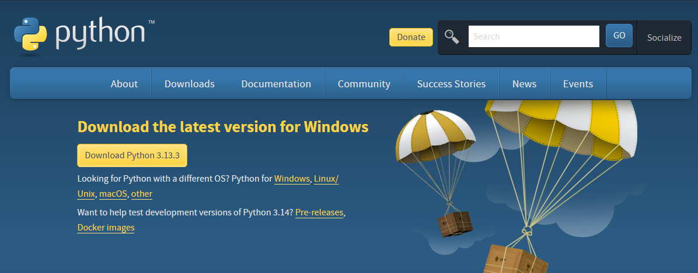

# iOS ShortCut DiscordRPC Server

iOS端末でゲームをする時にDiscord RPCを通してあなたのお友達に何をしているかを公開できます。<br>
<br>

---


<br>


<br>

## 🚀 機能
✅ **アプリケーションごとにDiscord Rich Presenceを自動更新**  
✅ **複数のアプリケーションをサポート（並列処理）**  
✅ **アプリケーション終了時にRich Presenceを閉じる**  
✅ **`processes.json`を介したカスタマイズ可能な設定**  
✅ **軽量で高速な実行**  

<br><br>


## 🎯 前準備
このアプリケーションは大きく分けて二つに分岐します。<br>
どちらでも利用は可能ですのでご安心ください。<br><br>

<details>
<summary>方法1: make-exeを利用する方法(推奨)</summary>

### Step 1: 必要なものをダウンロードする 
本アプリケーションの本方法は以下のものを利用します。
- Go 1.23以降
- Python 3.12.7以降
- PowerShell Core (7.5以降推奨)
- make-exe(darui3018823による制作)

<details>
<summary>Goのインストール</summary>

1. <a href="https://go.dev/dl/">Goのダウンロードページ</a>よりMicrosoft Windows向けのインストーラーをダウンロードします。<br>


2. 手順に沿いインストールを完了させます。<br>


> 画像での解説は<a href="https://qiita.com/ryome/items/8bc5d7c8cd51a351d016">こちら</a>の記事をご覧ください。<br>
> ※この記事はdarui3018823が提供しているものではありません。

</details>

<details>
<summary>Pythonのインストール</summary>

1. <a href="https://www.python.org/downloads/">Pythonのダウンロードページ</a>よりDownload Pythonのボタンをクリックしダウンロードします。<br>


2. 手順に沿いインストールを完了させます。<br>


3. pipを実行
後に利用するため、以下のコマンドを`Win+R`を押して実行してください。
```bash
pip install pyinstaller
```

> 画像での解説は<a href="https://qiita.com/Obataskill/items/4cfe0d4d8cec8a140b8e#python%E3%82%A4%E3%83%B3%E3%82%B9%E3%83%88%E3%83%BC%E3%83%AB%E6%89%8B%E9%A0%86">こちら</a>の記事をご覧ください。<br>
> ※この記事はdarui3018823が提供しているものではありません。

</details>

<details>
<summary>PowerShell Coreのインストール</summary>

詳細に関しましてはMicrosoft公式のページをご確認ください。<br>
<a href="https://learn.microsoft.com/ja-jp/powershell/scripting/install/installing-powershell-on-windows?view=powershell-7.5">Windows への PowerShell のインストール - PowerShell | Microsoft Learn</a>

1. wingetでダウンロードする<br>
以下のコマンドではbuild時に利用するPowerShell Core 7をインストールします。<br>
Windows PowerShell(Ver: 5.1以前)とは別環境になるためご安心ください。<br>
`.ps1`を利用するため5.1以前でも実行可能とは思いますがエラー時の対応はできませんのでご了承ください。<br>

```bash
winget install --id Microsoft.PowerShell --source winget
```

2. 手順に沿いインストールを完了させます。<br>
しばらく待っているとウィザードが出てきますので手順に沿ってインストールを完了させてください。

> 解説は<a href="https://tech.guitarrapc.com/entry/2025/01/14/235922">こちら</a>の記事をご覧ください。<br>
> ※この記事はdarui3018823が提供しているものではありません。

</details>

<details>
<summary>make-exeのインストール</summary>

1. <a href="https://github.com/darui3018823/make-exe/releases/download/v1.0.0/">Download make-exe.exe</a>よりダウンロードします。<br>
Downloadsに配置してください。

2. 環境変数にパスを通します。<br>
`.ps1`でmake-exeを環境変数で呼び出します。以下のコマンドをpowershellにペーストしてそのまま実行してください。

```pwsh
mkdir "$env:USERPROFILE/make-exe" -Force
Move-Item -Path "$env:USERPROFILE/Downloads/make-exe.exe" -Destination "$env:USERPROFILE/make-exe/"
$newPath = "$env:USERPROFILE\make-exe"
$currentPath = [Environment]::GetEnvironmentVariable("PATH", "User")
if ($currentPath -notlike "*$newPath*") {
    $newPathCombined = "$currentPath;$newPath"
    [Environment]::SetEnvironmentVariable("PATH", $newPathCombined, "User")
    Write-Output "ユーザー PATH に '$newPath' を追加しました。この変更を適用するにはターミナルを再起動してください。"
} else {
    Write-Output "指定のパス '$newPath' はすでに PATH に含まれています。"
}

```

> ご不明点は<a href="https://daruks.com/contact/">こちら</a>にお願いいたします。

</details>

### 一括ビルド

1. ビルドする
プロジェクトのディレクトリに移動し、以下のコマンドを実行してください。
```bash
./powershell/win/win_build_amd64_full.ps1
```

> ご不明点は<a href="https://daruks.com/contact/">こちら</a>にお願いいたします。
</details>

</details>

</details>

<details>
<summary>方法2: make-exeを使わない手動ビルド方法</summary>
make-exeを使用しない場合、pyinstaller を手動で利用して Python スクリプトを実行可能な .exe ファイルに変換する方法をご紹介いたします。

### Step 1: 必要なツールの準備
以下のものをインストールしておく必要があります（方法1と同じ内容）:
- Python 3.12.7 以降
- pip（Pythonに同梱されています）
- PowerShell Core（推奨）
- pyinstaller（後述の手順でインストール）


### Step 2: pyinstaller のインストール
PowerShell またはコマンドプロンプトを開き、以下のコマンドを実行してください：
```bash
pip install pyinstaller
```

### Step 3: プロジェクトのビルド
1. このプロジェクトのディレクトリに移動してください。

2. 以下のコマンドを実行します。
```bash
pyinstaller -onefile ./python/set_rpc.py
Move-Item -Path "./dist/set_rpc.exe" -Destination "./python/"
pyinstaller -onefile ./python/del_rpc.py
Move-Item -Path "./dist/del_rpc.exe" -Destination "./python/"

./powershell/win/win_build_amd64.ps1
```

> 詳細な解説等は<a href="https://daruks.com/contact/">こちら</a>よりお問い合わせをお願いいたします。

</details>


## 利用手順
前記のどちらかを完了していることが前提となります。

### iOSに導入
1. アプリのインストール<br>
iOS/iPadOS 向けに、Appleより提供されている"ショートカット"を利用します。以下よりインストールをしてください。<br>
<a href="https://apps.apple.com/jp/app/%E3%82%B7%E3%83%A7%E3%83%BC%E3%83%88%E3%82%AB%E3%83%83%E3%83%88/id1462947752">「ショートカット」をApp Storeで - App Store</a>

2. ショートカットを追加<br>
<a href="https://www.icloud.com/shortcuts/8e00f6c26ed0400fbacb297244bcdb5e">discord-rpc-example | iCloud Shortcut</a>

<a href="https://www.icloud.com/shortcuts/cbcf4a698f7f4fecb869a1325e2535fc">discord-rpc-example-del | iCloud Shortcut</a>

3. オートメーションを追加<br>
ここでは"Arcaea"を例に追加していきます。<br>
> 使用実機: iPad 9th, iPadOS 18.5


例にあるdelの方も3枚目を"閉じている"にし、同様に進めてください。
> `discord-rpc-arcaea`のサンプルは以下に掲載しております。
>> <a href="https://www.icloud.com/shortcuts/7fb4f94c3f66465eb4e89cd3aa6a15bc">discord-rpc-arcaea | iCloud Shortcut</a> <br>
>> <a href="https://www.icloud.com/shortcuts/83bb2cbf45d74dd996199300836ed387">discord-rpc-arcaea-del | iCloud Shortcut</a>

<br><br>


## お問い合わせ
- コードの問題に対するお問い合わせ
<a href="https://github.com/darui3018823/ios_rich_presence/issues">GitHub Issues</a>をご利用ください。

- インストールの手順やその他に関するお問い合わせ
<a href="https://daruks.com/contact/">ホームページ</a>をご利用ください。